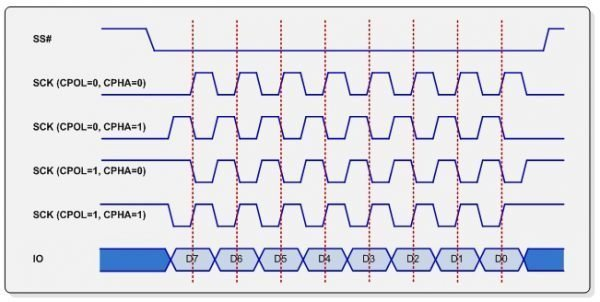

## Gif on Display

to enable gif support, you need to install and then enable it. Use `idf.py add-dependency "lvgl/lvgl^8"` to install it and run `idf.py menuconfig`.

```shell
Component config
└── LVGL configuration
    └── LVGL 3rd Party Libraries
        ├── [*] PNG decoder
        ├── [*] GIF decoder
        └── [*] File system on top of stdio API
```

and set the drive letter to '83' (S).


# **Doku: Das SPI-Protokoll (Serial Peripheral Interface)**

Das **Serial Peripheral Interface (SPI)** ist ein von Motorola entwickeltes, synchrones serielles Protokoll für die schnelle Datenübertragung über kurze Strecken. Typische Einsatzzwecke sind die Kommunikation zwischen Mikrocontrollern und Peripheriegeräten wie Speicherchips, Sensoren, SD-Karten und Displays.

---

### **Kernkonzept**

SPI ist ein **Master-Slave-Protokoll**:
Ein Gerät (der Master, meist ein Mikrocontroller) steuert die Kommunikation. Es können ein oder mehrere Slaves angeschlossen werden. Die Übertragung erfolgt **seriell** (Bit für Bit), aber **synchron** zum vom Master erzeugten Taktsignal.
**Warum so?** → Synchrones Protokoll: Schneller und einfacher als asynchrone (z.B. UART), da beide Seiten wissen, wann neue Daten anliegen.

---

### **Wichtige Signalleitungen (4 Drähte)**

1. **SCLK (Serial Clock):**
   Taktleitung vom Master, synchronisiert die Übertragung.
   → So wissen beide Seiten genau, wann Daten gültig sind.

2. **MOSI (Master Out, Slave In):**
   Datenleitung vom Master zum Slave.

3. **MISO (Master In, Slave Out):**
   Datenleitung vom Slave zum Master.

4. **CS (Chip Select) / SS (Slave Select):**
   Aktiviert das gewünschte Slave-Gerät („active low“). Jeder Slave braucht typischerweise eine eigene CS-Leitung.
   → Ermöglicht gezielte Kommunikation mit mehreren Geräten.



---

### **Ablauf einer SPI-Kommunikation**

1. **Slave auswählen:** Master zieht CS eines Slaves auf Low.
2. **Datenübertragung:**

   * Master gibt Takt auf SCLK aus.
   * Pro Takt wird **gleichzeitig** (Full-Duplex) ein Bit von Master zu Slave (MOSI) und ein Bit von Slave zu Master (MISO) übertragen.
     → Praktisch: In einem Vorgang können Daten gelesen und geschrieben werden!
3. **Übertragung beenden:** Master setzt CS wieder auf High.

**Technisch:** Intern arbeiten Schieberegister, die pro 8 Takte ein Byte verschieben.

---

### **SPI-Modi (CPOL & CPHA)**

Es gibt **vier SPI-Modi** – sie legen fest, an welcher Taktflanke Daten übertragen werden.

* **CPOL (Clock Polarity):** Leerlaufpegel des Takts (Low oder High)
* **CPHA (Clock Phase):** An welcher Taktflanke wird gelesen?
  → Master und Slave **müssen** im selben Modus arbeiten.

| Modus | CPOL | CPHA | Takt idle | Datenabtastung       |
| ----- | ---- | ---- | --------- | -------------------- |
| 0     | 0    | 0    | Low       | 1. Flanke (steigend) |
| 1     | 0    | 1    | Low       | 2. Flanke (fallend)  |
| 2     | 1    | 0    | High      | 1. Flanke (fallend)  |
| 3     | 1    | 1    | High      | 2. Flanke (steigend) |

**Warum gibt’s verschiedene Modi?** → Damit sich verschiedene Bausteine, die unterschiedlich ticken, problemlos verbinden lassen.

---

### **Typische Anwendungen**

* **SD-Karten**
* **(TFT-)Displays**
* **Sensoren** (Temperatur, Druck, Beschleunigung)
* **Speicherchips** (Flash, EEPROM)
* **ADCs/DACs**
* **Controller-zu-Controller-Kommunikation**
